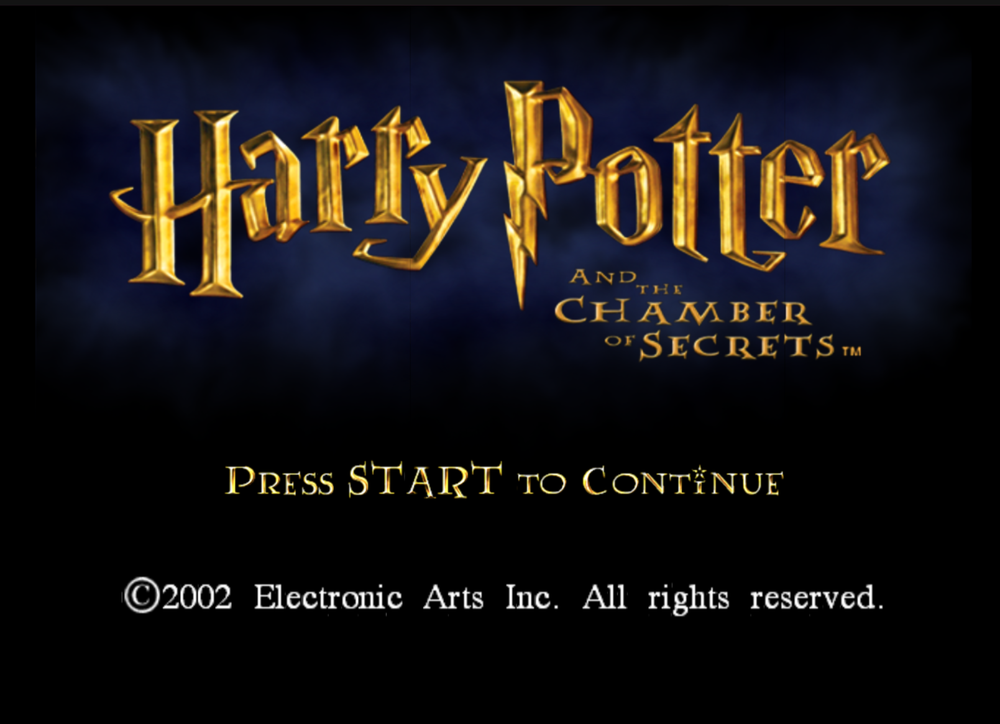
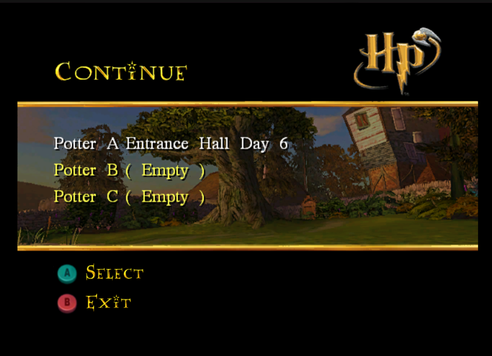
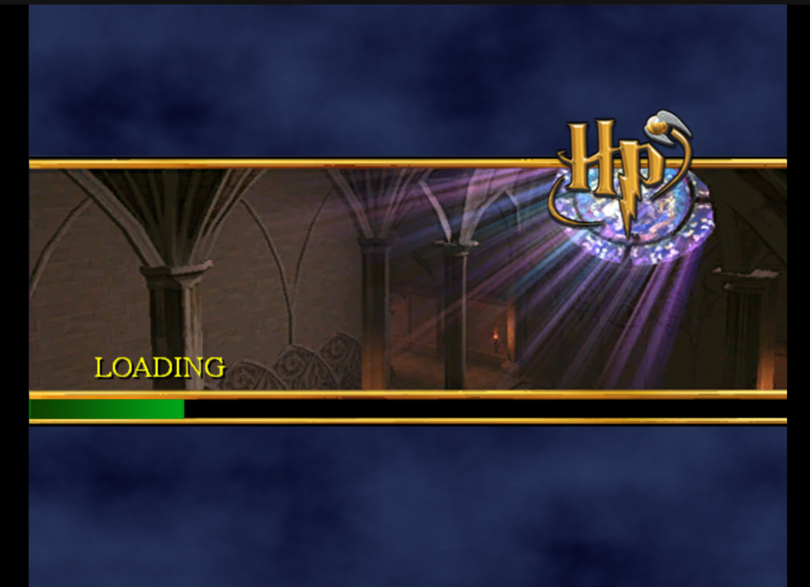
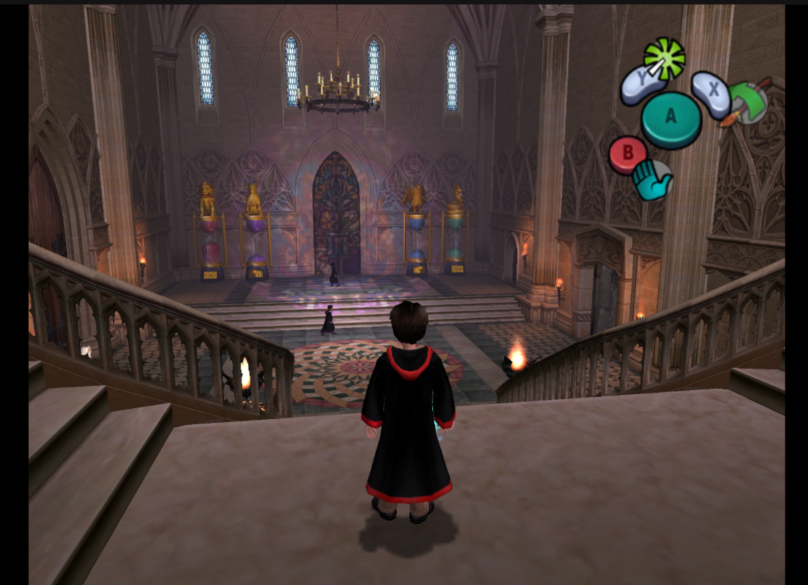
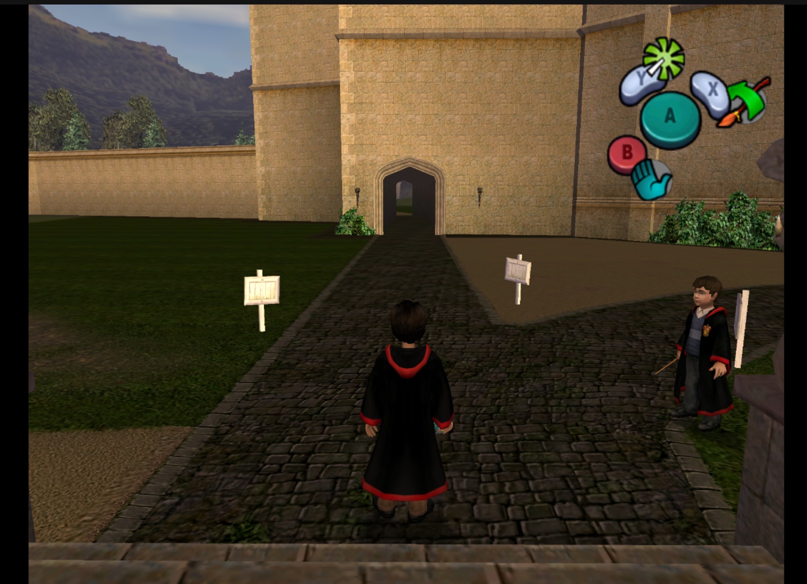
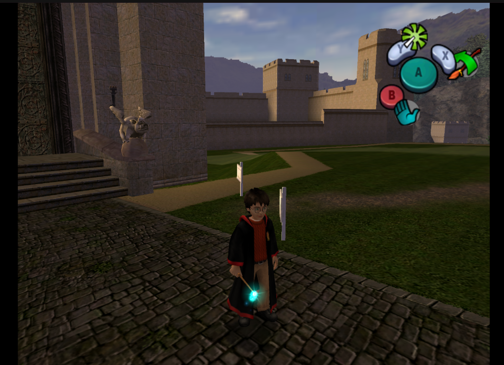

# Harry Potter and the Chamber of Secrets — GameCube Static Recompilation

<p align="center">
  
</p>

<p align="center">
  <strong>HPCOS GC</strong> — an experimental native static-recompilation project for
  <em>Harry Potter and the Chamber of Secrets</em> on Nintendo GameCube.
</p>

> [!IMPORTANT]
> **Work in progress.** No original disc image or extracted copyrighted game data is
> distributed by this repository. You must supply your own legally obtained copy of
> the game.

## Overview

**HPCOS GC** targets the North American GameCube release of
**Harry Potter and the Chamber of Secrets** (`GHSE69`).

The project uses the ExpansionPak GameCube/Wii recompilation stack, with
**DolRecomp** for static PowerPC recompilation and **ModernGekko** for the runtime.
The repository is intended to contain the actual HPCOS project state needed for
building and running the port — not only screenshots or documentation.

## Current status

HPCOS is actively under development. The current project reaches the title/menu
flow, loading and in-game scenes shown below.

## Screenshots

<table>
<tr>
<td align="center" width="50%"><br><sub>Title screen</sub></td>
<td align="center" width="50%"><br><sub>Continue menu</sub></td>
</tr>
<tr>
<td align="center" width="50%"><br><sub>Loading screen</sub></td>
<td align="center" width="50%"><br><sub>Entrance hall</sub></td>
</tr>
<tr>
<td align="center" width="50%"><br><sub>Castle yard</sub></td>
<td align="center" width="50%"><br><sub>Harry with his wand</sub></td>
</tr>
</table>

## Build layout

The checked-in project deliberately keeps the files that are required to reproduce
or run the current port:

```text
.
├── build.sh                  # configures/builds ModernGekko + DolRecomp + the GHSE69 module
├── run.sh                    # launches the published runtime/module
├── ModernGekko/              # source tree consumed by build.sh
├── DolRecomp/                # recompilation dependency/source when present locally
├── recomp/                   # HPCOS recompilation source/output
├── runtime/                  # published moderngekko-run + Sys runtime data
├── module/                   # published gGHSE69_recomp.so + build info
├── docs/screenshots/         # project screenshots
├── build/                    # local CMake/Ninja build directory — ignored
├── port-build/               # intermediate port build — ignored
├── extracted/                # user-supplied original game files — ignored
└── user/                     # local runtime profile/saves/configuration — ignored
```

`build.sh` validates the `GHSE69` `main.dol`, configures ModernGekko with CMake/Ninja,
builds `moderngekko-run`, `moderngekko-port` and `dolrecomp`, builds the recompilation
module, then atomically publishes the runnable outputs into `runtime/` and `module/`.

`run.sh` launches:

- `runtime/moderngekko-run`
- `module/gGHSE69_recomp.so`
- the user's local `extracted/` game directory
- a local `user/` runtime directory

## Building

Requirements include CMake, Ninja, a supported C/C++ toolchain and the dependencies
required by ModernGekko/DolRecomp. The current build script supports the `c` and
`llvm` recompilation backends and `clang`, `gcc` or automatic toolchain selection.

```bash
./build.sh
```

Examples:

```bash
BACKEND=c TOOLCHAIN=clang ./build.sh
BACKEND=llvm TOOLCHAIN=clang ./build.sh
```

The build expects your legally obtained game extraction at:

```text
extracted/sys/main.dol
```

The expected target is `GHSE69`; `build.sh` verifies the DOL SHA-256 before building.

## Running

After a successful build:

```bash
./run.sh
```

The current launcher uses Vulkan and Wayland.

## What is intentionally ignored

The `.gitignore` is intentionally conservative. It ignores only things that should
not be part of the repository: reproducible build directories, caches, release
staging, user-specific Dolphin/ModernGekko state, logs/backups, and original game
files supplied by the user.

Notably, **`runtime/`, `module/`, `recomp/`, `ModernGekko/`, `DolRecomp/`, `build.sh`
and `run.sh` are not ignored.**

## Credits and acknowledgements

HPCOS GC depends on open-source work from the GameCube/Wii recompilation and emulation
communities.

### ExpansionPak

- **DolRecomp** — static PowerPC recompiler used by GameCube/Wii recompilation projects.
  https://github.com/ExpansionPak/DolRecomp
- **ModernGekko** — runtime and tooling used to execute recompiled GameCube/Wii code.
  https://github.com/ExpansionPak/ModernGekko

### Upstream acknowledgements

ModernGekko credits and builds on work including:

- **SpecialK / aharonahdoot** — RecompCore
- **The Dolphin Team** — Dolphin and the GameCube/Wii hardware/runtime knowledge base
- **Literally God / MrPoloGit** — recompilation template/macOS work credited upstream

Please consult the upstream repositories, contributor histories and license files for
complete and authoritative attribution.

## Legal

This is an unofficial research/fan project and is not affiliated with or endorsed by
Electronic Arts, Warner Bros., Nintendo, ExpansionPak, or the original developers.

No original disc image or extracted copyrighted game assets should be committed to
this repository. Users must provide their own legally obtained game data.

## License

See [`LICENSE`](LICENSE) for HPCOS-specific repository content. Third-party components,
including DolRecomp, ModernGekko and their dependencies, remain subject to their own
licenses.
