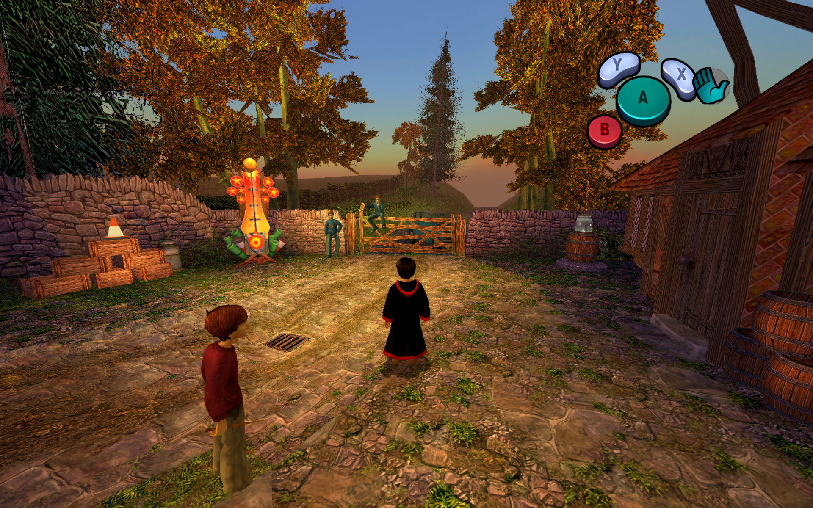
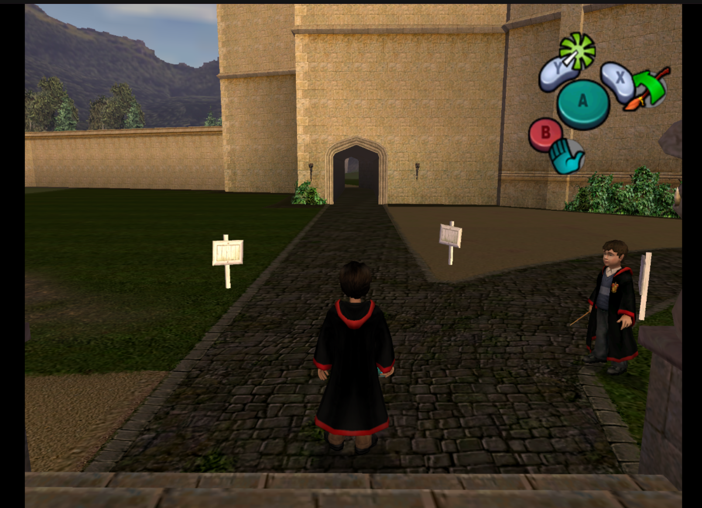
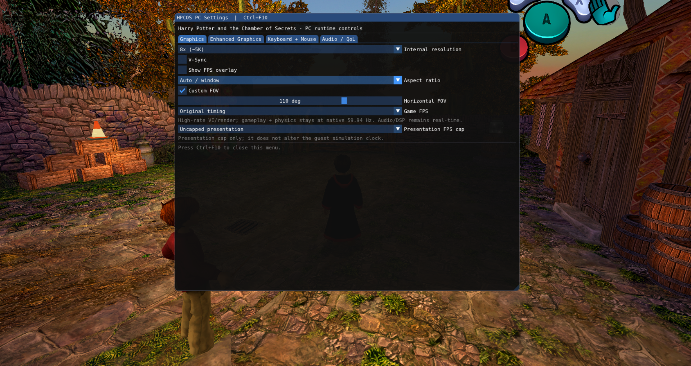
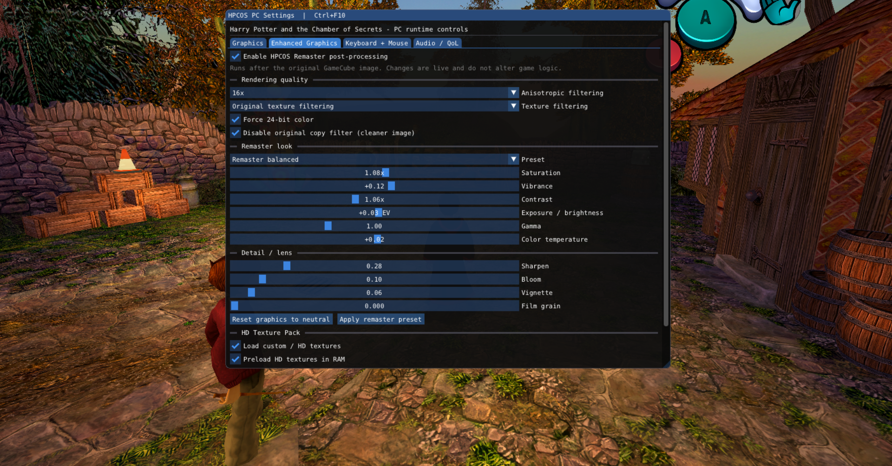
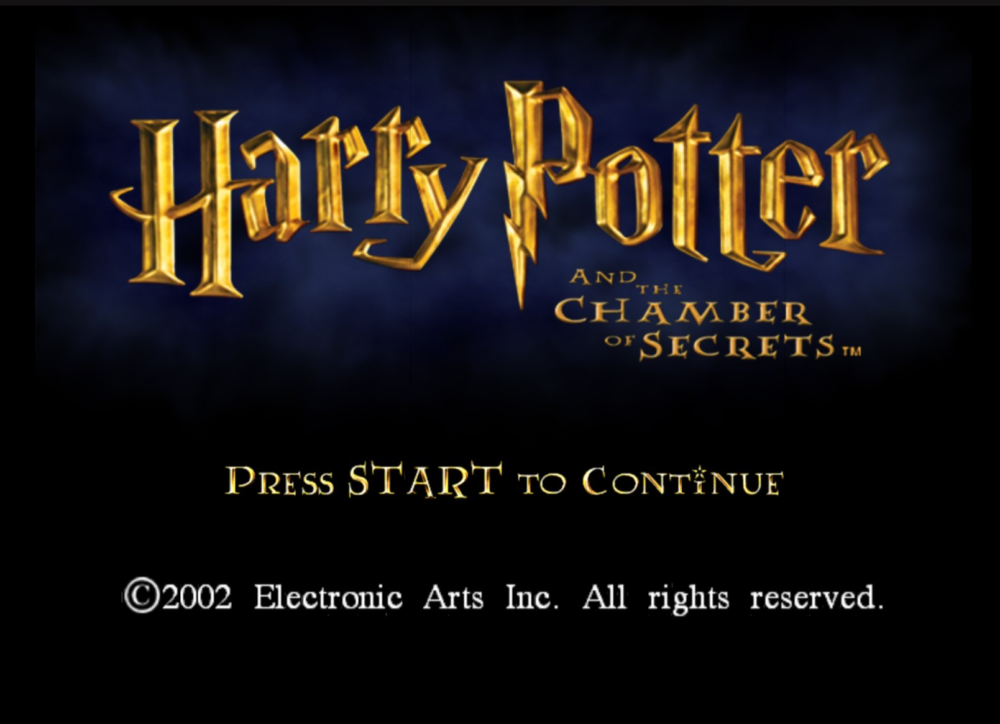
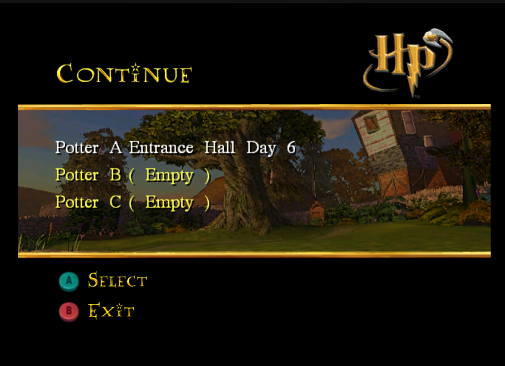
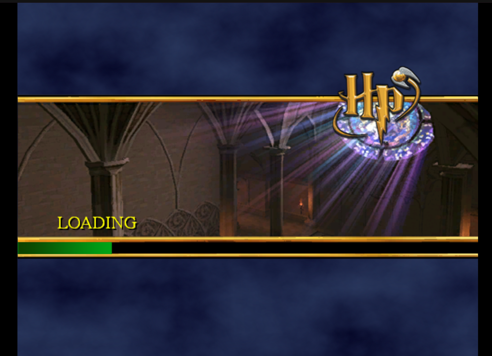
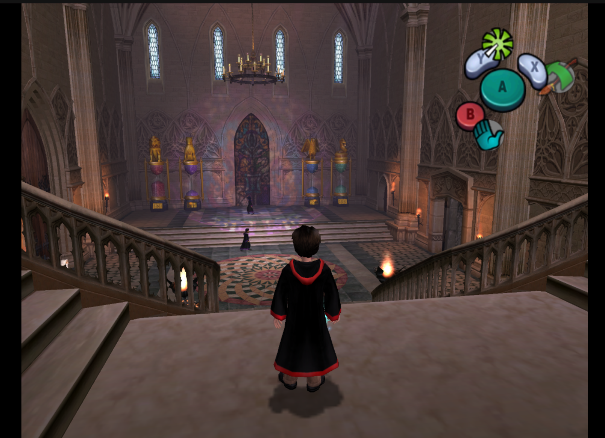
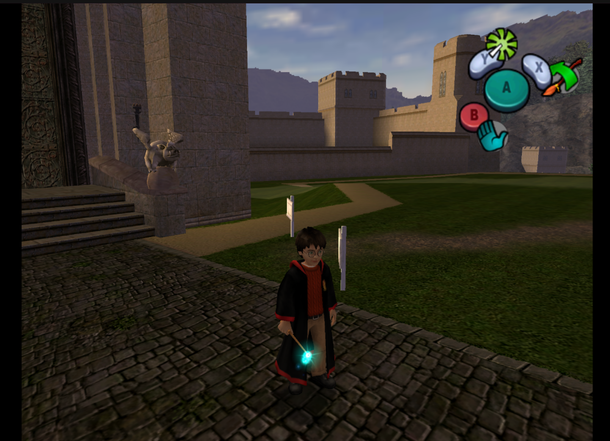

<div align="center">

# Harry Potter and the Chamber of Secrets

### GameCube Static Recompilation

**HPCOS GC** — experimental native PC recompilation of the North American GameCube release (`GHSE69`).

PowerPC → native code · DolRecomp + ModernGekko · Vulkan · Dynamic widescreen

</div>

<p align="center">
  <a href="#visual-comparison">GC vs enhanced recompilation</a> ·
  <a href="#in-game-pc-settings-menu">Live PC settings</a> ·
  <a href="#building">Build</a> ·
  <a href="#running">Run</a>
</p>

<p align="center">
  <a href="docs/screenshots/enhanced/burrow-gameplay.png"></a>
  <br>
  <em>1920×1200 gameplay capture · Dynamic widescreen · 110° FOV · 8× internal resolution · 16× AF</em>
</p>

> [!IMPORTANT]
> **Work in progress.** No original disc image or extracted copyrighted game data is distributed by this repository. You must supply your own legally obtained copy of the game. The custom/HD texture options shown below do not include a texture pack; any separately used pack must be supplied locally under its own terms.

## Visual comparison

**Original GC presentation → enhanced native recompilation.** The older project captures show the original 4:3 presentation; the new captures showcase dynamic widescreen, a wider field of view and the HPCOS Remaster post-processing controls.

<table>
  <tr>
    <th width="50%">GC — original presentation</th>
    <th width="50%">Recompilation — PC enhancements</th>
  </tr>
  <tr>
    <td><a href="docs/screenshots/05-castle-yard.png"></a></td>
    <td><a href="docs/screenshots/enhanced/burrow-gameplay.png"></a></td>
  </tr>
  <tr>
    <td>Original 4:3 presentation, before the showcased widescreen and remaster settings.</td>
    <td>Dynamic widescreen, 110° horizontal FOV, 8× internal resolution, 16× AF and remaster post-processing.</td>
  </tr>
</table>

These captures show **different locations and viewpoints**. They illustrate the overall presentation, not a frame-matched before/after test of textures or lighting. Click any screenshot to view the original image.

### Showcased settings

The supplied graphics-menu captures show the following configuration. The full gameplay image is **1920×1200 (16:10)**; the two menu images have different capture dimensions.

| Setting | Showcased configuration |
|---|---|
| Aspect ratio | **Auto / window** — dynamic widescreen |
| Horizontal FOV | **110°** |
| Internal resolution | **8× (~5K)** |
| Anisotropic filtering | **16×** |
| Texture filtering | Original texture filtering |
| Color / copy filter | Force 24-bit color; original copy filter disabled |
| Post-processing | **HPCOS Remaster enabled · Remaster balanced** |
| Color grading | Saturation **1.08×**, vibrance **+0.12**, contrast **1.06×** |
| Exposure / gamma / temperature | **+0.03 EV / 1.00 / +0.02** |
| Sharpening / bloom | **0.28 / 0.10** |
| Vignette / film grain | **0.06 / 0.000** |
| Custom / HD textures | Loading and RAM preloading enabled in the menu |
| Timing | Original game timing; uncapped host presentation; V-Sync off |

Enabling custom texture loading does not by itself confirm that a texture pack is installed. The screenshots document the menu settings without attributing the result to a specific pack.

### Graphics menu gallery

Open or close the live PC settings with **Ctrl+F10**.

<table>
  <tr>
    <th width="50%">Graphics — resolution, aspect & FOV</th>
    <th width="50%">Enhanced Graphics — remaster look & textures</th>
  </tr>
  <tr>
    <td><a href="docs/screenshots/enhanced/pc-graphics.png"></a></td>
    <td><a href="docs/screenshots/enhanced/pc-enhanced-graphics.png"></a></td>
  </tr>
</table>

## Overview

**HPCOS GC** targets the North American GameCube release of
**Harry Potter and the Chamber of Secrets** (`GHSE69`).

The project uses the ExpansionPak GameCube/Wii recompilation stack, with
**DolRecomp** for ahead-of-time PowerPC recompilation and **ModernGekko** for the
native runtime.

The goal is to run the original GameCube executable as statically recompiled native
code while preserving the behaviour of the original game and progressively adding
PC-oriented improvements in the runtime.

## Current status

The game currently reaches and runs:

- title and menu flow
- loading screens
- in-game scenes and normal gameplay
- audio
- controller input
- save/runtime state
- Vulkan rendering through ModernGekko/Dolphin

The current native build targets the original NTSC game timing.

## PC enhancements

### In-game PC settings menu

Press **Ctrl+F10** while the game is running to open the native HPCOS PC settings
overlay. The normal **F10** Dolphin pause hotkey is kept separate.

The overlay currently exposes live controls for:

- internal rendering resolution from native 1x through 12x
- 16× anisotropic filtering, texture filtering, 24-bit color and copy-filter controls
- HPCOS Remaster post-processing with color grading, sharpening, bloom, vignette and film grain
- custom/HD texture loading and RAM preloading
- V-Sync and the FPS performance overlay
- original 4:3, automatic host aspect, 16:9, 16:10, 21:9 and 32:9 modes
- horizontal FOV override, synchronized with the GHSE69 guest camera/frustum
- high-rate game VI/render target (60/90/120/144/165/240) with gameplay/physics held at native ~59.94 Hz
- optional host presentation FPS cap
- keyboard + mouse input merged with the normal GameCube controller on Port 1
- mouse sensitivity and Y-axis inversion
- direct in-menu keyboard/mouse rebinding
- runtime volume and mute controls

Settings and custom bindings are persisted in `HPCOS_PC.ini` inside the runtime
configuration directory.

Default keyboard/mouse bindings are **WASD** for movement, mouse movement for the
C-stick/camera, left/right/middle mouse for A/B/Z, **E/Q** for X/Y,
**Left Shift/Left Ctrl** for L/R, **Enter** for Start and the arrow keys for the
D-pad. Gamepad input remains enabled at the same time.

> [!NOTE]
> The menu has two separate FPS controls. **Game FPS** raises the guest VI/render
> cadence without changing Dolphin's global emulation speed. GHSE69's phase-1
> gameplay/physics update (`0x80038DAC`) is separately scheduled at the native
> ~59.94 Hz, while DSP/audio and CoreTiming remain on their normal clock.
> **Presentation FPS cap** only limits host presentation. Above 60 FPS the renderer
> currently presents the latest fixed simulation state between updates; true motion
> interpolation is a separate refinement.

### Dynamic widescreen

HPCOS includes a runtime widescreen implementation rather than relying on a fixed
16:9 game patch.

The projection is adjusted dynamically from the actual host aspect ratio, allowing
the 3D view to adapt to displays such as:

- 16:9
- 16:10
- ultrawide aspect ratios
- other window aspect ratios

For wider displays the 3D projection uses a Hor+ style adjustment instead of simply
stretching the original 4:3 image.

Enable it with:

```bash
./run-linux.sh --widescreen
```

### Configurable FOV

A horizontal FOV can be selected at launch:

```bash
./run-linux.sh --widescreen --fov 110
```

`--fov` represents the requested **horizontal** field of view.

The runtime synchronizes the corresponding game-side camera/frustum FOV used by
`GHSE69`. The previous generic host perspective-FOV override has been removed:
that layer also affects auxiliary perspective passes such as shadow cameras and
could make shadows disappear when a custom FOV was active.

Dynamic widescreen also synchronizes all three GHSE69 aspect globals used by the
original game's 16:9 patch. This makes the guest frustum/culling use the expanded
aspect instead of keeping a hidden 4:3 visibility window, reducing objects popping
out near the left and right edges.

### XFB / presentation correction

The presentation path includes an XFB crop used to remove the original overscan-style
bordering and make better use of the host window while preserving the dynamically
corrected aspect ratio.

### HUD behaviour

The 3D projection and orthographic paths are handled separately so increasing the
world aspect ratio does not simply stretch the HUD together with the scene.

## Static recompilation and runtime work

HPCOS is not just a wrapper around an emulator.

The original GameCube PowerPC code is processed by DolRecomp and translated ahead of
time into native code that executes through the ModernGekko runtime.

Project-specific work currently includes:

- PowerPC static recompilation fixes and runtime integration
- optimized generated-code dispatch paths
- SMC / recompilation runtime optimizations
- optimized PowerPC emitter paths
- direct handling of common guest execution cases
- GameCube memory/MMIO/runtime integration
- guest-side camera/FOV synchronization
- host-side projection and presentation changes

The focus is to keep the recompiled execution path as native and lightweight as
possible while retaining compatibility with the original GameCube software.

## Original presentation gallery

<table>
<tr>
<td align="center" width="50%"><br><sub>Title screen</sub></td>
<td align="center" width="50%"><br><sub>Continue menu</sub></td>
</tr>
<tr>
<td align="center" width="50%"><br><sub>Loading screen</sub></td>
<td align="center" width="50%"><br><sub>Entrance hall</sub></td>
</tr>
<tr>
<td align="center" width="50%"><br><sub>Castle yard</sub></td>
<td align="center" width="50%"><br><sub>Harry with his wand</sub></td>
</tr>
</table>

## Build layout

The checked-in project deliberately keeps the files required to reproduce or run the
current port:

```text
.
├── build-linux.sh                  # configures/builds ModernGekko + DolRecomp + the GHSE69 module
├── run-linux.sh                    # launches the published runtime/module
├── ModernGekko/              # source tree consumed by build-linux.sh
├── DolRecomp/                # recompilation source/tooling
├── recomp/                   # HPCOS recompilation source/output
├── runtime/                  # published moderngekko-run + Sys runtime data
├── module/                   # published gGHSE69_recomp.so + build info
├── docs/screenshots/         # project screenshots
├── build/                    # local CMake/Ninja build directory — ignored
├── port-build/               # intermediate port build — ignored
├── extracted/                # user-supplied original game files — ignored
└── user/                     # local runtime profile/saves/configuration — ignored
```

`build-linux.sh` validates the `GHSE69` `main.dol`, configures ModernGekko with CMake/Ninja,
builds `moderngekko-run`, `moderngekko-port` and `dolrecomp`, builds the recompilation
module, then publishes the runnable outputs into `runtime/` and `module/`.

`run-linux.sh` launches:

- `runtime/moderngekko-run`
- `module/gGHSE69_recomp.so`
- the user's local `extracted/` game directory
- a local `user/` runtime directory

## Building

Requirements include CMake, Ninja, a supported C/C++ toolchain and the dependencies
required by ModernGekko/DolRecomp.

The current build script supports the `c` and `llvm` recompilation backends and
`clang`, `gcc` or automatic toolchain selection.

```bash
./build-linux.sh
```

Examples:

```bash
BACKEND=c TOOLCHAIN=clang ./build-linux.sh
BACKEND=llvm TOOLCHAIN=clang ./build-linux.sh
```

The build expects your legally obtained game extraction at:

```text
extracted/sys/main.dol
```

The expected target is `GHSE69`; `build-linux.sh` verifies the DOL before building.

## Running

Basic launch:

```bash
./run-linux.sh
```

Dynamic widescreen:

```bash
./run-linux.sh --widescreen
```

Showcased widescreen and **110° horizontal FOV**:

```bash
./run-linux.sh --widescreen --fov 110
```

Open **Ctrl+F10 → Graphics** to select **8× internal resolution** and **Auto / window** aspect. Use a **1920×1200** output/window for the showcased 16:10 presentation. Under **Enhanced Graphics**, enable HPCOS Remaster, select **Remaster balanced** and **16× AF**, then match the [showcased settings](#showcased-settings). Internal rendering resolution and output size are separate settings.

For an original-style comparison, select **Original 4:3**, disable **Custom FOV**, disable remaster post-processing and custom/HD textures, and restore native resolution and original filtering in the PC menu. Settings persist between sessions, so a plain launch may retain previous enhancements.

Experimental 120 FPS VBI target:

```bash
./run-linux.sh --widescreen --fov 110 --fps 120
```

The current launcher uses Vulkan and Wayland.

## Experimental project

HPCOS GC is still under active development.

Rendering, recompilation accuracy, performance and game compatibility may change as
the static recompilation runtime continues to be investigated and optimized.

The runtime offers higher VI/render targets and uncapped host presentation while preserving native ~59.94 Hz gameplay/physics timing. True motion interpolation between simulation updates remains a separate refinement.

## What is intentionally ignored

The `.gitignore` is intentionally conservative. It ignores things that should not be
part of the repository, including reproducible build directories, caches, release
staging, user-specific Dolphin/ModernGekko state, logs and original game files
supplied by the user.

Original game data must never be committed.

## Credits and acknowledgements

HPCOS GC depends on open-source work from the GameCube/Wii recompilation and emulation
communities.

### ExpansionPak

- **DolRecomp** — static PowerPC recompiler used by GameCube/Wii recompilation projects  
  https://github.com/ExpansionPak/DolRecomp
- **ModernGekko** — runtime and tooling used to execute recompiled GameCube/Wii code  
  https://github.com/ExpansionPak/ModernGekko

### Upstream acknowledgements

ModernGekko credits and builds on work including:

- **SpecialK / aharonahdoot** — RecompCore
- **The Dolphin Team** — Dolphin and the GameCube/Wii hardware/runtime knowledge base
- **Literally God / MrPoloGit** — recompilation template/macOS work credited upstream

Please consult the upstream repositories, contributor histories and license files for
complete and authoritative attribution.

## Legal

This is an unofficial research/fan project and is not affiliated with or endorsed by
Electronic Arts, Warner Bros., Nintendo, ExpansionPak, or the original developers.

No original disc image or extracted copyrighted game assets are distributed by this
repository. Users must provide their own legally obtained game data. Optional third-party HD texture packs must be obtained separately and used under their respective terms; the settings screenshots do not distribute those packs.

## License

See [`LICENSE`](LICENSE) for HPCOS-specific repository content.

Third-party components, including DolRecomp, ModernGekko and their dependencies,
remain subject to their respective licenses.
